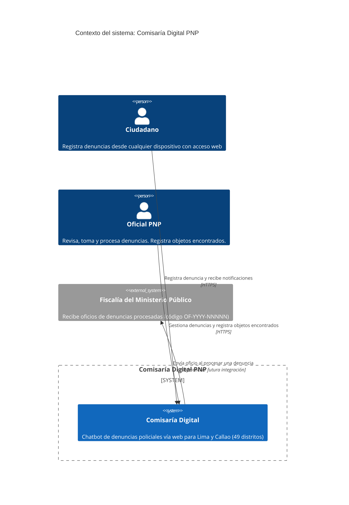
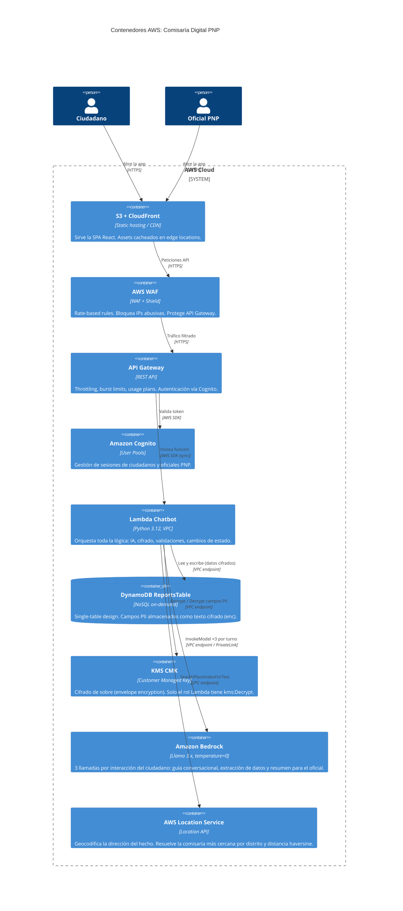
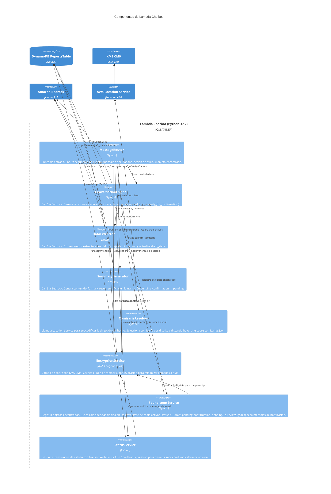

# Arquitectura C4 — Comisaría Digital PNP

Diagramas C4 (Context → Container → Component) de los servicios AWS
involucrados en el chatbot de denuncias policiales para Lima y Callao.

---

## Nivel 1 — Contexto del sistema

---

## Nivel 2 — Contenedores AWS

---

## Nivel 3 — Componentes de Lambda Chatbot

---

## Notas

| Servicio | Motivo de uso |
|---|---|
| **CloudFront + S3** | Distribución global de la SPA con bajo costo; sin servidor propio |
| **AWS WAF** | Rate-limiting por IP para prevenir abuso; protege frente a bots |
| **API Gateway** | Throttling configurable; usage plans por tipo de usuario |
| **Amazon Cognito** | Gestión de sesiones sin implementar auth propio |
| **Lambda** | Sin servidor; escala a cero cuando no hay tráfico |
| **DynamoDB on-demand** | Costo proporcional al uso; single-table optimizado para los patrones de acceso definidos |
| **KMS CMK** | Cifrado a nivel de campo en la capa de aplicación; los datos PII nunca llegan en claro a DynamoDB |
| **Amazon Bedrock** | Llama 3.x vía PrivateLink; tráfico sin salir a internet; `temperature=0` para determinismo |
| **AWS Location Service** | Geocoding sin depender de Google Maps; datos de localización no salen de AWS |
